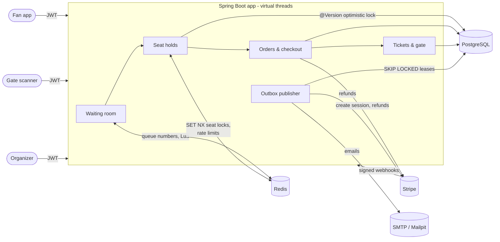
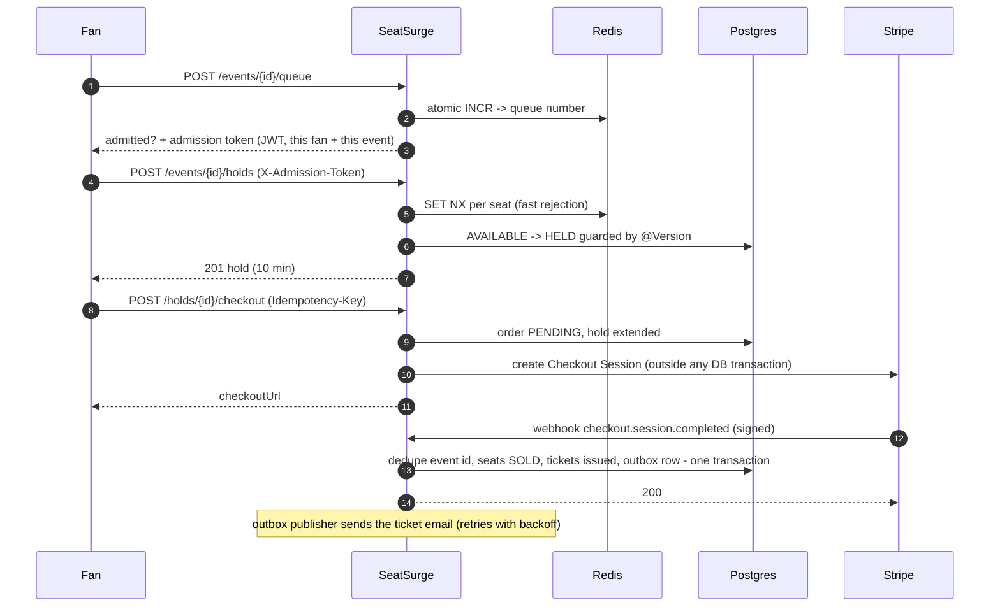

# SeatSurge

**A flash-sale ticketing backend that doesn't oversell.** SeatSurge handles the moment a big concert goes on sale, when thousands of fans hit "buy" in the same second. It covers the whole journey: a fair waiting room, time-limited seat holds, Stripe checkout, QR e-tickets and gate check-in.

- **Zero oversells:** verified by concurrency tests (200 threads racing for 10 seats) and a k6 stampede (1,000 fans for 200 seats).
- **Exactly-once effects** on an at-least-once world: idempotent checkout, deduplicated webhooks, transactional outbox.
- **40 REST endpoints**, documented with OpenAPI; **45 automated tests** against real Postgres and Redis.

**Tech stack:** Java 25 · Spring Boot 4.1 (MVC on virtual threads) · Spring Security + JWT · Spring Data JPA / Hibernate · PostgreSQL 17 · Flyway · Redis (Lua) · Stripe · springdoc-openapi · Testcontainers · Docker · GitHub Actions · k6

---

## Architecture



**A purchase, end to end**



## The hard problems, and how they're solved

### 1. Never oversell a seat
| Layer | Mechanism |
|---|---|
| Fast path | Redis `SET NX PX` per seat. Contended requests are rejected without opening a DB transaction; locks are released by a compare-and-delete Lua script so nobody frees a lock they don't own. |
| Source of truth | Postgres: seats flip `AVAILABLE -> HELD` in one transaction guarded by a JPA `@Version` column. A racing transaction gets an optimistic-lock failure and the whole hold rolls back (all-or-nothing). |
| Per-fan limit | A partial unique index allows only one ACTIVE hold per fan per event, so parallel requests from one fan can't get around the ticket limit. |
| Expiry | A sweeper returns timed-out holds using compare-and-set status updates, safe on many instances. |
| Degradation | If Redis is down, holds keep working in Postgres-only mode. |

**Proof:** 200 virtual threads race for 10 seats and exactly 10 win. Overlapping 3-seat requests never leave a seat double-held or a partial hold behind. Both pass **with and without Redis**. Removing `@Version` makes the Postgres-only run oversell (13 winners for 10 seats), so the test demonstrably catches the bug.

### 2. Fair access under a stampede: virtual waiting room
- **Queue numbers** come from an atomic, idempotent Lua script. 100 concurrent joins get exactly 1..100, and retries keep their place.
- **Admission is computed, not stored:** `allowance(now) = rate + rate x minutes since sale start`, and a fan is in when `number <= allowance`. There's no gatekeeper job, and every instance agrees.
- **Admission token:** a short-lived JWT bound to one fan and one event (`typ=admission`). Access and admission tokens can't be swapped, and holds verify it without a Redis call.
- **Sliding-window rate limits** (Redis ZSET + Lua) on holds, queue joins and logins: `429` with `Retry-After`, no burst at window boundaries, and they fail open.

### 3. Payments that are exactly-once in effect
```
hold --checkout--> order PENDING + Stripe session   (hold extended to cover Stripe's 30-min minimum)
  completed webhook  --> hold CONVERTED, seats SOLD, tickets issued, email queued (one transaction)
  expired webhook    --> order CANCELLED, seats + Redis locks released
  paid but hold lost --> REFUND_PENDING --> outbox --> Stripe refund --> REFUNDED
```
- **Idempotency-Key** on checkout replays the stored response (`422` if a key is reused for a different request). Orders are unique per hold, and Stripe calls carry their own idempotency keys.
- **Stripe is never called inside a DB transaction.** A slow provider can't pin connections or row locks.
- **Webhooks:** the HMAC signature and timestamp are verified, and events are deduplicated by event id *in the same transaction* as the state change. Redeliveries are safe.
- **Transactional outbox:** emails and refunds commit with the business change and are delivered at least once by a poller. It claims rows with `FOR UPDATE SKIP LOCKED` leases (a crashed worker's lease expires) and retries with exponential backoff.

### 4. Tickets at the gate
- **Check-in is one conditional `UPDATE ... WHERE checked_in_at IS NULL`:** 50 simultaneous scans of one ticket give exactly 1 `ADMITTED` and 49 `ALREADY_CHECKED_IN`.
- **Transfers rotate the ticket code**, so a screenshot of the old QR code stops working instantly.
- **Cancelling an event** is one transaction: holds released, every paid order queued for refund, all tickets voided.

## Load test (k6)

`load/flash-sale.js` registers 1,000 fans, fires them all **at the same instant** at a 200-seat event (one random seat each), then verifies from the server's side that no seat is owned twice and that winners match the seat inventory.

Results on a single laptop (8 vCPU Docker VM running k6, the app, Postgres and Redis together), 3 measured runs after warm-up:

| Metric | Result |
|---|---|
| Oversells | **0 in every run**: 201 responses == seats owned afterwards (197-199 of 200*) |
| Unexpected errors | 0 (every request answered 201 or 409) |
| Hold latency p50 | **~200-230 ms** |
| Hold latency p95 | ~0.9-1.1 s (end-to-end, load generator on the same machine) |
| Server-side time for rejected requests (409) | p95 ~125 ms (Tomcat access log) |

\* Fans pick seats at random, so a few seats are never chosen; that's expected, not lost inventory.

What the numbers taught me (details in the commit history):
- A first version passed all 1,000 tokens through k6's `setup()`, which every VU copies. That meant ~300 MB of JSON parsing at the start gun, and requests trickled out over 2 s. Each VU now registers itself before the start gun.
- Raising the Hikari pool from 10 to 30 **did not** improve p95 on this CPU-bound machine, so the default was kept. Measure before tuning.

```bash
docker compose --profile app up -d --build        # app + Postgres + Redis + Mailpit in containers
docker run --rm -i --network seatsurge_default -v "$PWD/load:/load" \
  -e BASE_URL=http://app:8080 grafana/k6 run /load/flash-sale.js
```

## Testing

`./mvnw verify` runs **45 tests** against real **PostgreSQL 17 and Redis 7 via Testcontainers**, with Stripe and SMTP replaced by in-memory fakes that record every call. Highlights:
- **Concurrency:** 200-thread seat race (with and without Redis), 50-scanner gate race, 100 concurrent queue joins.
- **Payments:** idempotent checkout replay, exactly-once fulfillment under webhook redelivery, forged, tampered or stale signatures, Stripe outage retry, automatic refund of late payments.
- **Reliability:** outbox retry with backoff, refresh-token reuse detection, clock-skew-proof time assertions.

CI runs on GitHub Actions for every push and pull request (`.github/workflows/ci.yml`), and also builds the Docker image.

## API overview

Full interactive docs: **Swagger UI at `/swagger-ui.html`**.

| Area | Endpoints |
|---|---|
| Auth | `POST /api/v1/auth/{register,login,refresh,logout}`, `GET /api/v1/users/me` |
| Venues (organizer) | `POST/GET /api/v1/venues`, `GET/PUT /api/v1/venues/{id}`, `POST /api/v1/venues/{id}/sections`, `DELETE /api/v1/venues/{id}/sections/{sectionId}` |
| Events (organizer) | `POST /api/v1/events`, `PUT/DELETE /api/v1/events/{id}`, `POST /api/v1/events/{id}/{publish,cancel}`, `GET /api/v1/events/mine`, `GET /api/v1/events/{id}/stats` |
| Events (public) | `GET /api/v1/events?q=&city=&category=&from=&to=`, `GET /api/v1/events/{id}`, `GET /api/v1/events/{id}/seats` |
| Waiting room (fan) | `POST/GET/DELETE /api/v1/events/{id}/queue` |
| Seat holds (fan) | `POST /api/v1/events/{id}/holds` (`X-Admission-Token` for waiting-room events), `GET /api/v1/holds`, `GET/DELETE /api/v1/holds/{id}` |
| Orders & checkout (fan) | `POST /api/v1/holds/{id}/checkout` (`Idempotency-Key`), `GET /api/v1/orders`, `GET /api/v1/orders/{id}` |
| Webhooks | `POST /api/v1/webhooks/stripe` (`Stripe-Signature`) |
| Tickets (fan) | `GET /api/v1/me/tickets`, `GET /api/v1/tickets/{id}`, `GET /api/v1/tickets/{id}/qr` (PNG), `POST /api/v1/tickets/{id}/transfer` |
| Gate | `POST /api/v1/gate/check-in` (GATE_STAFF, the event's organizer, ADMIN) |
| Admin | `POST/GET /api/v1/admin/users`, `PUT /api/v1/admin/users/{id}/status` |

Errors use **RFC 7807 Problem Details** with a stable machine-readable `code` (for example `SEATS_UNAVAILABLE`, `ADMISSION_REQUIRED`, `IDEMPOTENCY_KEY_REUSED`), and every response carries an `X-Request-Id`.

## Running it

Prerequisites: **JDK 25** and **Docker**.

```bash
./mvnw spring-boot:run     # starts Postgres, Redis and Mailpit from compose.yaml automatically
./mvnw verify              # all tests (Testcontainers)
docker compose --profile app up --build   # or run everything, including the app, in containers
```

- Swagger UI: http://localhost:8080/swagger-ui.html
- Mailpit (dev inbox for ticket emails): http://localhost:8025
- Health: http://localhost:8080/actuator/health

| Env var | Purpose |
|---|---|
| `JWT_SECRET` | Base64 256-bit signing key (a dev default is provided) |
| `STRIPE_SECRET_KEY` / `STRIPE_WEBHOOK_SECRET` | Stripe test-mode keys (`sk_test_...`, `whsec_...`) |
| `ADMIN_EMAIL` / `ADMIN_PASSWORD` | Bootstrap admin, created at startup only if the password is set |

**With real Stripe (test mode):**
```bash
stripe listen --forward-to localhost:8080/api/v1/webhooks/stripe   # prints whsec_...
STRIPE_SECRET_KEY=sk_test_... STRIPE_WEBHOOK_SECRET=whsec_... ./mvnw spring-boot:run
```
Pay with `4242 4242 4242 4242`; the ticket email shows up in Mailpit.

## Project structure
```
src/main/java/com/seatsurge
├── auth/          JWT access + admission tokens, refresh-token rotation, security filter
├── venue/ event/  catalog: venues, sections, bulk seat generation, events, pricing, search, stats
├── seat/          per-event sellable seats (@Version)
├── waitingroom/   Redis queue numbers, time-based admission
├── hold/          seat holds: Redis locks + optimistic locking, expiry sweeper
├── order/ payment/  checkout, Stripe gateway, webhooks, refunds
├── ticket/        tickets, QR codes, gate check-in, transfers
├── notification/  ticket emails (outbox handler)
├── admin/         user management, bootstrap admin
└── common/        errors (RFC 7807), idempotency, outbox, rate limiting, config
src/main/resources/db/migration   Flyway migrations (V1 schema, V2 hold locking, V3 waiting room)
load/flash-sale.js                k6 stampede with server-side oversell verification
```

## Design decisions & known limits
- **MVC + virtual threads rather than WebFlux:** the workload is transactional and JPA-bound. Virtual threads give high concurrency with simple blocking code, readable stack traces and ordinary `@Transactional`.
- **Postgres is always the source of truth.** Redis only speeds things up (fast rejection, queue numbers, rate limits); losing it never breaks correctness.
- **Known limits:**
  - A disabled user's access token keeps working until it expires (at most 15 min); blocking it immediately would need a per-request DB check.
  - The queue is first-come, first-served (no randomized pre-sale lobby).
  - Transfers don't count against the recipient's ticket limit.
